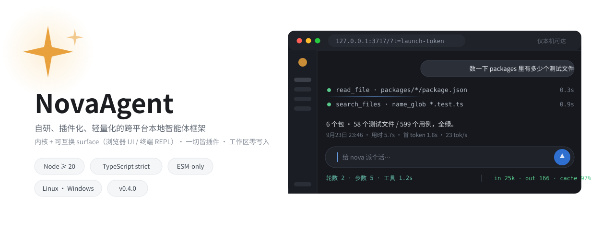
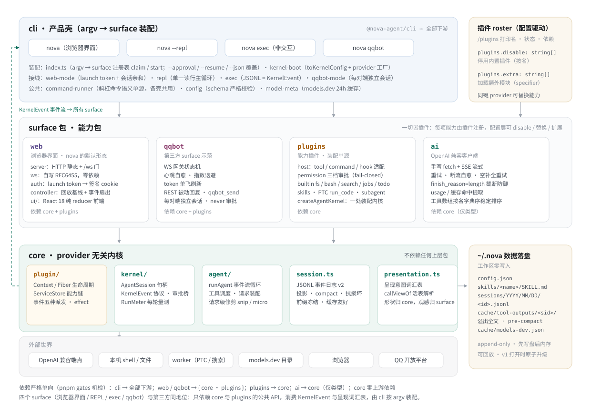
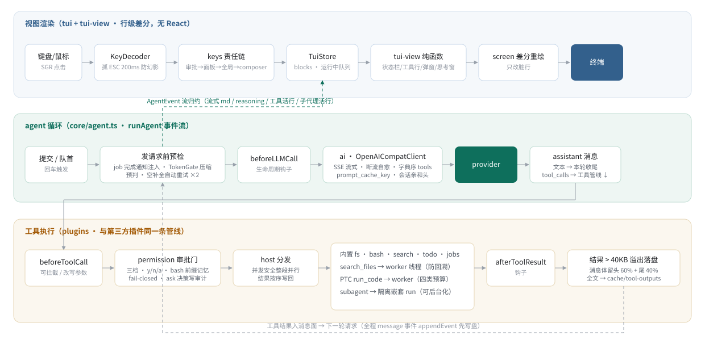
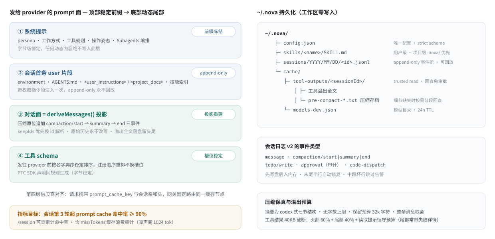

# NovaAgent

自研、插件化、轻量化的跨平台本地智能体框架——一个在**当前工作目录**运行的 agent CLI / TUI：通过任意 OpenAI 兼容端点对接模型，以"一切皆插件"的内核统一扩展工具、斜杠命令、生命周期钩子与 Skills。所有数据（配置 / 会话 / 缓存 / 技能）集中在 `~/.nova/` 下，**运行目录零写入**。


> 完整设计、约定与里程碑见 [AGENTS.md](./AGENTS.md)（人机共读的**唯一权威文档**）；版本号遵循 [Semantic Versioning 2.0.0](https://semver.org/lang/zh-CN/)，公共 API 定义见其 §10。

## 快速开始

```bash
pnpm install
pnpm build
pnpm nova            # 交互运行：TTY 下全屏 TUI，非 TTY 自动回落 readline
```

配置写在 `~/.nova/config.json`（唯一来源，`apiKey` 支持 `{env:NAME}` 引用环境变量）：

```jsonc
{
  "provider": {
    "baseURL": "https://api.example.com/v1",
    "apiKey": "{env:MY_KEY}",
    "model": "model-name"
  },
  "approval": "read-only"          // read-only | auto-edit | full
}
```

任意 OpenAI 兼容端点均可对接——填好 `baseURL` 与 `model` 即跑。之后：

```bash
nova -- --approval auto-edit       # 临时覆盖审批档位
nova exec "修复失败的测试" --json   # 非交互单次执行（JSONL 事件流，CI 友好）
nova qqbot                         # QQ 机器人模式（配置 qqbot.appId/clientSecret）
```

全局安装：`cd packages/cli && npm link`，之后任意目录直接 `nova`。

## 核心能力

| 能力 | 说明 |
| --- | --- |
| 一切皆插件 | 工具 / 命令 / 钩子（beforeLLMCall · beforeToolCall · afterToolResult）走同一 `PluginContext` API、同一审批门；内置 fs/bash 与第三方插件无特权差别 |
| 前缀缓存命中 | 系统提示字节冻结，动态内容注入会话首条片段（append-only）；工具 schema 字典序稳定排序；携带 `prompt_cache_key` 与会话亲和头——目标第 3 轮起命中率 ≥ 90% |
| 原位压缩保真 | compaction 三事件原位追加、原始历史永不改写；codex 式七节摘要无字数上限，压缩前全文存档可分段回查；自动阈值预判 + 熔断 |
| 审批与边界 | 三档审批 + `y/n/a`（bash 按命令程序前缀记忆）；fail-closed；realpath 工作区边界 + 原子写 + 陈旧检测；审批决策写审计事件可回放 |
| PTC 代码模式 | `run_code` 写 async TS 程序，子调用穿过与原生完全相同的审批管线；每 run 全新 worker 线程，堆 / busy-time / 墙钟 / 输出四类预算 |
| 隔离子代理 | `subagent` 工具跑全新消息面（上下文隔离、结构防递归、同审批门同钩子），可后台运行，执行进度可点击展开 |
| 自研 TUI | 零依赖行级差分渲染；`/` 命令面板、审批弹窗、运行中消息队列、流式 markdown、思考活窗口、单行三段式状态栏（tps / cache 命中率）、SGR 鼠标点击展开 |
| 后台 jobs | `run_in_background` 返回句柄，`jobs` 读写增量输出；job 完成自动注入通知（至少一次送达），模型无需轮询 |
| search_files | content_regex / name_glob 二选一；回溯炸弹进全新 worker 线程执行；默认跳过 `.git`/`node_modules`、绝不跟随符号链接 |
| Skills | 渐进加载：启动只注入 name+description 索引，命中才载正文；双层发现（项目级优先于用户级） |
| 模型元数据 | 后台拉 models.dev（24h TTL 落盘缓存），解析上下文窗口 / 模态 / 推理能力喂状态栏仪表与 `/model` `/session` 面板 |

## 架构总览

pnpm monorepo，依赖方向强制单向：`cli → {tui, tui-view, plugins, ai, qqbot, core}`，`tui-view → {tui, core}`，`plugins / ai / qqbot → core`，`core` 与 `tui` 零上游依赖——纯视图层可脱终端单测，内核不感知渲染与供应商。

### 包分层



| 包 | 职责 |
| --- | --- |
| `core` | provider 无关的 agent 循环（async generator 事件流）、append-only 消息模型、JSONL 会话日志 v2 与投影、工具调度、token 预估、后台 jobs、subagent |
| `ai` | OpenAI 兼容手写客户端：fetch + SSE 流式、工具调用、重试与断流自愈、usage / 缓存命中提取 |
| `plugins` | 微型插件容器（工具 / 命令 / 钩子注册）、权限审批引擎、内置工具集、skills、PTC 代码运行时 |
| `tui` | 零依赖终端原语：行级差分渲染、按键解码（含 SGR 鼠标）、CJK 显示宽度 |
| `tui-view` | TUI 纯视图层（零终端 IO）：调色板、裁剪族、状态栏、弹窗、composer、思考窗、开屏、帧装配 |
| `cli` | 产品壳：全屏 TUI + readline 回落 + 非交互 exec + qqbot 模式 + 配置发现 + 模型元数据 |
| `qqbot` | 第一个第三方插件示范：QQ 开放平台 WS 网关状态机、REST 回复、`qqbot_send` 工具——只依赖 core/plugins 公共 API |

### 单轮运行数据流



三条泳道：键盘经责任链进 `TuiStore`，`runAgent` 发请求前先做 job 通知注入、压缩预判与空补全重试；工具调用逐个过审批门再分发，并发安全调用整段并行、结果按序写回；每个事件 `appendEvent` 先写盘后入内存，原始历史永不改写。

### 上下文组装与持久化



一切围绕**稳定前缀换缓存命中率**：四层机制（前缀冻结 / 追加式日志 / 原位压缩投影 / 供应商亲和路由）把动态内容压到 prompt 面的最底部。

## 常用命令

```bash
pnpm dev          # tsx 直跑 cli（免构建，改完即生效）
pnpm nova         # 交互运行（跑 packages/cli/dist，改完 src 需先 build）
pnpm test         # vitest run（注入 fetch + SSE fixture，不发真实请求）
pnpm typecheck    # tsc --noEmit（逐包）
pnpm lint         # oxlint packages（含 complexity/max-depth/长函数 warn）
pnpm check        # 本地快环：lint + 结构棘轮 + 变更相关测试（秒级）
pnpm verify       # 全环：build + typecheck + test + 结构棘轮（提交前跑）
pnpm changeset    # 写变更集（面向用户改动记录）
pnpm release      # 升版 + 同步根包版本 + commit + tag 一条龙
```

## 开发与质量

- **测试不联网**：单元（纯函数 + `plainPalette` 确定断言）/ ai 层注入 `fetch` + SSE fixture / 接缝集成（全管道、resume 投影一致性、帧装配超宽检查）三层体系——当前 **60 个测试文件、628 个用例**，提交前 `pnpm verify` + `pnpm lint` 全绿。
- **跨平台**：Linux / Windows 为测试目标（macOS 顺带兼容）；所有路径走 `node:path` + 抽象层，禁止硬编码分隔符；bash 工具 Windows 优先 Git Bash、回落 PowerShell 并强制 UTF-8。
- **里程碑**：M1（agent 核心）→ M8.5（TUI 现代化）已发行 0.3.0，M9（治理换血与结构棘轮）进行中；逐条机制详录归档 [docs/MILESTONES.md](./docs/MILESTONES.md)，现状与方向见 [AGENTS.md §7](./AGENTS.md)。
- **信任姿态**：bash / `run_code` 在本机执行任意命令（审批门 + 工作区边界，无沙箱）；重隔离建议容器化运行。

---

[AGENTS.md（完整文档）](./AGENTS.md) · [TUI 设计决策](./docs/tui-design.md) · [仓库](https://github.com/H2O-ME/nova) · [回到顶部](#novaagent)
